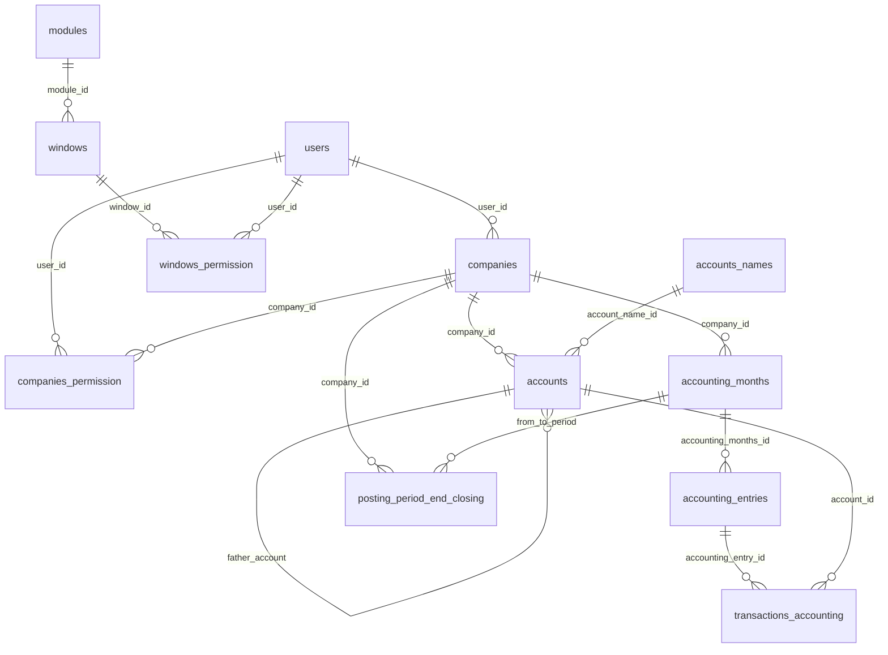

# Modelos de base de datos `aries` — mapa para migración

Fuente: dumps MySQL 8.0.35 en `C:\Users\Steve\Desktop\Aries DUMP` (31 ene 2025), host RDS `ariescontrol`.  
Base: `aries`. Charset de tablas: **latin1**. Default del schema en el dump: utf8mb4.

Este documento mapea **tablas → modelos C# → stored procedures**. Es la referencia para unificar escritorio 1.x y `AriesWebApi`.

No incluye filas de datos (compañías, usuarios, correos). Solo estructura y contratos.

---

## 1. Vista del esquema

```text
users 1───N companies
 users 1───N companies_permission N───1 companies
 users 1───N windows_permission
 users 1───N modules (updated_by)
 users 1───N windows (updated_by)

modules 1───N windows 1───N windows_permission

companies 1───N accounts
accounts_names 1───N accounts
accounts 1───N accounts (father_account, árbol)

companies 1───N accounting_months          (= PostingPeriod)
accounting_months 1───N accounting_entries (= JournalEntry)
accounting_entries 1───N transactions_accounting (= JournalEntryLine)
accounts 1───N transactions_accounting

companies 1───N posting_period_end_closing
accounting_months ── from_period_id / to_period_id ── posting_period_end_closing

usuarios_correo   (sin FK, log SMTP)
actividades / tareas  (vacías, no usadas por el producto)
```



---

## 2. Tablas y columnas

### 2.1 Núcleo contable

#### `companies`

| Columna | Tipo | Notas |
|---|---|---|
| `company_id` | varchar(**5**) PK | Código `C001`… En hijos suele ser varchar(**4**). Inconsistencia a unificar. |
| `type_id` | int unsigned NOT NULL | 1 jurídica, 2 física, 3+ otros (DIMEX/NITE en código). Hay `KEY type_id` **sin FK**: quedó de una tabla de tipos que ya no existe. |
| `number_id` | varchar(20) UNIQUE | Cédula |
| `name` | varchar(50) | En Core: `CompanyName` (Dapper a veces espera `Name`) |
| `money_type` | enum('Colones y Dolares','Colones','Dolares') | Core: `CurrencyTypeCompany` |
| `op1`, `op2` | varchar(50) | Apellidos / razón social extra |
| `address`, `website`, `mail` | varchar | |
| `phone_number1/2` | varchar(50) | |
| `notes` | varchar(100) | Core: `Notes` / `Memo` |
| `user_id` | int unsigned NULL | FK `users`. **Permite NULL** (TODO en `Program.cs`). |
| `created_at`, `updated_at` | timestamp | |
| `active` | tinyint(1) default 1 | Soft delete |

**Modelo:** `AriesContador.Core.Models.Companies.Company`.  
**Legacy:** `CapaEntidad` comentó su `Company` y reusa Core.  
**Acceso:** SP `SP_InsertCompany` (fix Fase 1: `OUT NewCompanyId = Code`) y `SP_UpdateCompany` (`scripts/mysql/fase1`). Listados también SQL embebido en `CompañiaDao` y `AdministrationQuery` (`user_id AS CreatedBy`). `Company.UserId` es alias de `CreatedBy`.

#### `users`

| Columna | Tipo | Notas |
|---|---|---|
| `user_id` | int unsigned AI PK | Core: `Id` |
| `user_name` | varchar(20) UNIQUE | Login |
| `user_type` | enum('Usuario','Administrador') | Core: `UserType` |
| `number_id` | varchar(20) UNIQUE | |
| `name`, `lastname_p`, `lastname_m` | varchar(50) | Core: `Name`, `LastName`, `MiddleName` |
| `phone_number`, `mail`, `notes` | | |
| `password` | varchar(255) NOT NULL | Hash `pbkdf2$iter$salt$hash` (fase 7). Login acepta plano y rehashea. Script: `scripts/mysql/fase7`. |
| `created_at`, `updated_at` | timestamp | |
| `updated_by` | int NULL | **Sin FK.** A veces guarda cédula, no `user_id`. |
| `active` | tinyint(1) | |

**Modelo:** `User`. **Legacy:** `Usuario`.  
**SP en dump:** `SP_GetAllUsers`, `SP_FindUserById`.  
**SP Fase 1** (`scripts/mysql/fase1`): `SP_InsertUser` (OUT `@Id` = `LAST_INSERT_ID()`), `SP_UpdateUser`. Password sigue en texto plano.  
**Login Fase 5:** `UserRepository.FindByUserName` (SQL parametrizado `AdministrationQuery.FindUserByUserName`, equivalente a `UsuarioDao.Login`). No usa `SP_GetAllUsers`. El hash de password sigue siendo un paso posterior.

#### `accounts_names`

Catálogo de nombres únicos. El plan de cuentas **no guarda el texto** en `accounts`; guarda `account_name_id`.

| Columna | Tipo |
|---|---|
| `account_name_id` | int unsigned AI PK |
| `name` | varchar(50) UNIQUE |

Funciones/SP: `GetAccountName`, `SP_GetOrCreateAccountName`, `SP_UpdatePartlyAccount` (INSERT IGNORE).

Al copiar plan de cuentas entre compañías se reutiliza el mismo `account_name_id`.

#### `accounts`

| Columna | Tipo | Modelo Core |
|---|---|---|
| `account_id` | int unsigned AI PK | `Id` |
| `account_name_id` | int unsigned FK | `Name` se resuelve por JOIN; al insertar el SP espera el **id**, no el texto |
| `father_account` | int unsigned NULL FK self | `FatherAccount`. CASCADE al borrar padre |
| `previous_balance_c` | double(12,2) | `PriorBalance` (colones) |
| `previous_balance_d` | double(12,2) | `PriorBalanceForeign` (dólares) |
| `company_id` | varchar(**4**) FK CASCADE | `CompanyId` |
| `account_type` | enum ACTIVO/PASIVO/PATRIMONIO/INGRESO/`COSTO VENTA`/EGRESO | `AccountTag` (1–6) |
| `account_guide` | enum TITULO / CUENTA DE MAYOR / CUENTA AUXILIAR | `AccountType` (1–3) |
| `editable` | tinyint(1) | `Editable` |
| `detail` | varchar(50) | `Memo` |
| `created_at`, `updated_at` | | |
| `updated_by` | int unsigned FK users | `UpdatedBy` |
| `active` | tinyint(1) | `Active` |

**Cuidado en `SP_InsertAccount`:** los parámetros se llaman `AccountType` y `AccountTag` pero el INSERT los **cruza**:

```text
account_type  ← AccountTag
account_guide ← AccountType
```

Eso coincide con los enums C# (`AccountType` = guía título/mayor/auxiliar, `AccountTag` = activo/pasivo/…). Hay que preservar el cruce o renombrar al migrar.

**Modelo:** `Account` : `BaseAccount`. **Legacy:** `Cuenta` + `ITipoCuenta` (Activo, Pasivo, …).

#### `accounting_months` (= periodo contable)

| Columna | Tipo | Core `PostingPeriod` |
|---|---|---|
| `accounting_months_id` | int unsigned AI PK | `Id` |
| `month_report` | date NOT NULL | `Date` (día 1 del mes) |
| `closed` | tinyint(1) | `Closed` |
| `company_id` | varchar(4) FK **RESTRICT** | `CompanyId` |
| `created_at`, `updated_at` | | |
| `updated_by` | int unsigned NOT NULL | (sin FK declarada) |
| `active` | tinyint(1) | `Active` |

Unique `(company_id, month_report)`: script `fase11/01`. En la copia Docker de 2026-09 **aún no** se aplicó: `C001` tiene duplicados en 2021-01, 2022-10, 2022-11 y 2022-12. La unicidad de mes en app la impone `FinancialService.CreatePostingPeriod`.

**Legacy:** `FechaTransaccion`.

#### `accounting_entries` (= asiento)

| Columna | Tipo | Core `JournalEntry` |
|---|---|---|
| `accounting_entry_id` | int unsigned AI PK | `Id` |
| `entry_id` | int unsigned | `Number` (consecutivo **por periodo**, no PK) |
| `accounting_months_id` | int unsigned FK | `PostingPeriodId` |
| `convalidated` | tinyint(1) | |
| `convalidated_at` | timestamp NULL | |
| `status` | enum('In Progress','Approved','Convalidated') | `JournalEntryStatus` 1/2/3 |
| `updated_by` | FK users | |
| `active` | tinyint(1) | soft delete / restore |

No hay unique `(accounting_months_id, entry_id)`. El consecutivo lo da `SP_GetJournalEntryConsecutive`.

#### `transactions_accounting` (= línea de asiento)

| Columna | Tipo | Core `JournalEntryLine` |
|---|---|---|
| `transaction_accounting_id` | int unsigned AI PK | `Id` |
| `account_id` | FK accounts RESTRICT | `AccountId` |
| `accounting_entry_id` | FK entries RESTRICT | `JournalEntryId` |
| `reference` | varchar(100) | `Reference` |
| `detail` | varchar(100) | `Memo` |
| `balance` | double(18,2) | `Amount` |
| `foreign_amount` | double(18,2) | `ForeignAmount` |
| `balance_type` | enum('Debito','Credito') | `DebOrCred` |
| `money_type` | enum('Colones','Dolares') | `Currency` |
| `money_chance` | double(8,2) default 1 | `RateAmount` (tipo de cambio) |
| `bill_date` | date | `Date` |
| `updated_by` | FK users | |
| `active` | tinyint(1) | restore vía `SP_RestoreJournalEntryLine` |

Tabla más grande del dump (~44 MB, AI ~272991).

#### `posting_period_end_closing`

Cierre de ejercicio / rango de meses.

| Columna | Tipo | Core `PostingPeriodEndClosing` |
|---|---|---|
| `Id` | int unsigned AI PK | `Id` (único PK llamado `Id`, no `*_id`) |
| `company_id` | varchar(4) FK CASCADE | `CompanyId` |
| `from_period_id`, `to_period_id` | FK `accounting_months` RESTRICT | |
| `from_period`, `to_period` | varchar(50) | nombres cacheados ("enero 2020") |
| `amount` | double(18,2) | resultado P&G del cierre |
| `user_notes` | varchar(100) | |
| `updated_by` | FK users | |

SP: `SP_InsertClosingPostingPeriod`, `SP_GetClosingPostingPeriodReport`, `SP_ClosePeriod`.

---

### 2.2 Seguridad y UI (stack legacy)

#### `modules`

| Columna | Tipo | Notas |
|---|---|---|
| `module_id` | int unsigned AI PK | |
| `internal_name` | varchar(50) UNIQUE | Código: `Mconta`, `Mcompanias`, `Mseguridad`, `Musuarios` |
| `external_name` | varchar(50) | Texto de menú |
| `users` | enum('Usuario','Administrador') | Quién ve el módulo |
| `updated_by` | FK users | |
| `active`, `deleted` | tinyint(1) | Doble bandera de baja |

**Modelo:** `CapaEntidad.Entidades.Ventanas.Modulo`. Sin equivalente rico en Core.

#### `windows`

| Columna | Tipo | Notas |
|---|---|---|
| `window_id` | int unsigned AI PK | |
| `module_id` | FK modules RESTRICT | |
| `internal_name` | varchar(50) UNIQUE | Nombre del Form WinForms |
| `external_name` | varchar(50) | |
| `is_report` | tinyint(1) | |
| `active`, `deleted` | tinyint(1) | |

Seed alineado con `VentanaInfo`:

| window_id | internal_name | Form |
|---|---|---|
| 1 | FormMaestroCuenta | Maestro de cuentas |
| 2 | FormAsientos | Asientos |
| 3 | FormAdminMeses | Periodos |
| 4 | FormMaestroCompanias | Compañías |
| 5 | FormMaestroUsuario | Usuarios |
| 6 | FormPermisoUsuario | Permisos |

#### `windows_permission`

CRUD por usuario × módulo × ventana: `u_insert`, `u_update`, `u_remove`, `u_list`. PK `permission_manager_id`. Unique `(user_id, module_id, window_id)`. **Sin FK declaradas** a users/modules/windows. También tiene `active` y `deleted`.  
Usado por `PermisoCL` / `Guachi`. El API 2.0 **no** expone esto.

#### `companies_permission`

Qué compañías puede ver un `Usuario` (no Administrador). PK `companies_permission_id`. Unique `(user_id, company_id)`. `company_id` varchar(4). **Sin FK.** Columnas `active` y `deleted`.  
`CompañiaDao.GetAll` filtra por esto cuando el tipo es Usuario.

---

### 2.3 Satélites (fuera del dominio Core)

| Tabla | Columnas | Código |
|---|---|---|
| `usuarios_correo` | `mailusuario_id`, `nombre`, `apellido`, `correo_electronico`, `correo_copia`, `asunto`, `titulo`, `mensaje`, `ultimo_envio`, `estado` enum CORRECTO/FALLIDO. Sin FK. | `CorreoCL` / `CorreoDao` / `UsuarioTemporal` |
| `actividades` | `id`, `actividad` | Vacía. No hay referencias en C# |
| `tareas` | `id`, `idactividad` (sin FK), `tarea`, `hecho` | Vacía. No hay referencias en C# |

Candidatas a **no migrar** o a un bounded context aparte (correo fiscal).

---

## 3. Vistas

Definidas en `aries_routines.sql`:

### `accounting_entries_info`

Join líneas + asientos + meses + cuentas + nombres. Solo `active = 1`. Columnas: `company_id`, `month_report`, `entry_id`, `account_name`, `JournalEntryLineId`, `reference`, `detail`, `bill_date`, `debit`, `credit`, `money_type`, `money_chance`, `balance_usd`.

### `account_info`

Agrega débitos/créditos (CRC y USD) por cuenta y mes (`YYYYMM`). `cuadrado` = 0 si hay asientos `status = In Progress`.

Los reportes nuevos **no usan estas vistas**; usan SP (`SP_JournalEntryReportByDateRange`, `SP_EstadoResultadoIntegralReport`, …). Las vistas importan para reportes SQL ad hoc y posiblemente DAOs viejos.

---

## 4. Funciones

| Función | Retorno | Qué hace |
|---|---|---|
| `F_GetAccountPathForReport(accountid)` | text | Camina `father_account` y concatena nombres con `¡`. Usada en reportes SP. |
| `GETFULLPATH(accountid)` | text | Misma idea (path de cuenta). |
| `GetAccountName(AccountName)` | int | Busca o **inserta** en `accounts_names` y devuelve el id. Tiene efecto de escritura. |

Al migrar a otro motor o a queries en C#, estas funciones hay que reimplementar (el árbol de cuentas es recursivo).

---

## 5. Stored procedures

Dump: `aries_routines.sql`. Definers `kenneth@%`. **37 procedimientos**, 3 funciones, 2 vistas.

### 5.1 Catálogo y quién los llama

| SP | Tablas | Repositorio / uso | En dump |
|---|---|---|---|
| `SP_InsertCompany` | companies | `CompanyRepository` | sí (fix `scripts/mysql/fase1/01_fix_SP_InsertCompany.sql`) |
| `SP_UpdateCompany` | companies | `CompanyRepository.Update` | sí (`scripts/mysql/fase1/02_SP_UpdateCompany.sql`) |
| `SP_InsertUser` | users | `UserRepository.Add` | sí (`scripts/mysql/fase1/03_SP_InsertUser.sql`) |
| `SP_UpdateUser` | users | `UserRepository.Update` | sí (`scripts/mysql/fase1/04_SP_UpdateUser.sql`) |
| `SP_GetAllUsers` | users | `UserRepository`, `AuthController` | sí |
| `SP_FindUserById` | users | `UserRepository` | sí |
| `SP_InsertAccount` | accounts | `AccountRepository`, create company | sí |
| `SP_UpdateAccount` | accounts | `AccountRepository` | sí |
| `SP_UpdatePartlyAccount` | accounts + names | no visto en repos actuales | sí |
| `SP_DesactivateAccount` | accounts | `AccountRepository.Remove` | sí |
| `SP_GetAccountById` | accounts | `AccountRepository` | sí |
| `SP_GetAccountsByCompanyId` | accounts | `AccountRepository` | sí |
| `SP_GetOrCreateAccountName` | accounts_names | no en repos (sí función equivalente) | sí |
| `SP_AccountHasMovements` | lines+entries | no en repos C# | sí |
| `SP_AuxiliaryAccountsWithBalanceByDateRange` | accounts | `AccountRepository` / balance comprobación | sí |
| `SP_InsertPostingPeriod` | accounting_months | `PostingPeriodRepository` | sí |
| `SP_GetAllPostingPeriod` | accounting_months | `PostingPeriodRepository` | sí |
| `SP_ClosePeriod` | accounting_months | `PostingPeriodRepository` | sí |
| `SP_InsertClosingPostingPeriod` | posting_period_end_closing | `PostingPeriodRepository` | sí |
| `SP_GetPostingPeriodReport` | accounting_months | `FinancialReportRepository` | sí |
| `SP_GetClosingPostingPeriodReport` | posting_period_end_closing | `FinancialReportRepository` | sí |
| `SP_InsertJournalEntry` | accounting_entries | `JournalEntryRepository` | sí |
| `SP_UpdateJournalEntry` | accounting_entries | `JournalEntryRepository` | sí |
| `SP_DesactivateJournalEntry` | accounting_entries | `JournalEntryRepository.Remove` | sí |
| `SP_RestoreJournalEntry` | accounting_entries | `JournalEntryRepository` | sí |
| `SP_GetJournalEntryById` | accounting_entries | `JournalEntryRepository` | sí |
| `SP_GetJournalEntryByPostingPeriodId` | entries (+ lines) | `JournalEntryRepository` | sí |
| `SP_GetJournalEntryConsecutive` | accounting_entries | `JournalEntryRepository` | sí |
| `SP_GetJournalEntryDeletedBydDateRange` | accounting_entries | `JournalEntryRepository` (typo *Byd*) | sí |
| `SP_InsertJournalEntryLine` | transactions_accounting | `JournalEntryLineRepository` | sí |
| `SP_UpdateJournalEntryLine` | transactions_accounting | `JournalEntryLineRepository` | sí |
| `SP_DesactivateJournalEntryLine` | transactions_accounting | `JournalEntryLineRepository` | sí |
| `SP_RestoreJournalEntryLine` | transactions_accounting | `JournalEntryLineRepository` | sí |
| `SP_GetJournalEntryLineById` | transactions_accounting | `JournalEntryLineRepository` | sí |
| `SP_GetJournalEntryLineByJournalEntryId` | transactions_accounting | `JournalEntryLineRepository` | sí |
| `SP_GetAllJournalEntyLineByAccoudIdAndPostingPeriodId` | lines | `JournalEntryLineRepository` (typos) | sí |
| `SP_GetAllJournalEntryLineByAccountId` | lines | no en repos | sí |
| `SP_GetJournalEntyLineDeletedByDateRange` | lines | `JournalEntryLineRepository` | sí |
| `SP_JournalEntryReportByDateRange` | vista lógica líneas | `FinancialReportRepository` | sí |
| `SP_EstadoResultadoIntegralReport` | accounts + movements | `FinancialReportRepository` | sí |

Typos en nombres de SP son **parte del contrato**. Renombrar rompe Dapper. Migración: alias o wrapper con el mismo nombre.

### 5.2 Huecos de dump cubiertos en Fase 1

Los SPs que Data ya llamaba y **no estaban en el dump** viven en `scripts/mysql/fase1/`. Aplicar solo en copia (Docker `aries` / `AriesContabilidad_Local` en 3307), nunca RDS.

El dump original de `SP_InsertCompany` hacía `SET NewCompanyId = CompanyId` (variable inexistente). El script `01_fix_SP_InsertCompany.sql` usa `SET NewCompanyId = Code`. `CompanyRepository.Add` no lee el OUT; envía `Code` del cliente.

`GetCompanyConsecutive` **no es SP**: `CompanyRepository.LatestCode()` (`SELECT company_id … LIMIT 1`) + formato `"C" + n` en `AdministrationService`.

### 5.3 Huecos de dump cubiertos en Fase 3

SPs de cuentas para el maestro WinForms. Aplicar `scripts/mysql/fase3/` solo en copia. **`SP_InsertAccount` no se toca** (copia de plan al crear compañía).

| SP | Qué cubre del escritorio |
|---|---|
| `SP_InsertChildAccount` | `CuentaDao.Insert`: nombre, `previous_balance_*`, si el padre es auxiliar mueve líneas y lo pasa a mayor |
| `SP_UpdateAccountNameInfo` | `CuentaDao.UpdateNameInfo` |
| `SP_AccountNameTaken` | Unique name con `account_type = 1` (ACTIVO) |
| `SP_AccountHasOpenPeriodMovements` | Guard de `CuentaDao.Deleted` (meses abiertos) |
| `SP_GetAccountBalancesFromAccountInfo` | Vista `account_info` YYYYMM como `CuentaConSaldos` |

#### Contrato Dapper (fase 3)

| SP | Parámetros | Notas |
|---|---|---|
| `SP_InsertChildAccount` | `Name`, `PriorBalance`, `PriorBalanceForeign`, `FatherAccount`, `CompanyId`, `AccountType` (guía), `AccountTag` (activo…), `Memo`, `Editable`, `UpdatedBy`, OUT `Id` | cruce igual que `SP_InsertAccount` |
| `SP_UpdateAccountNameInfo` | `Id`, `Name`, `Memo`, `CompanyId`, `UpdatedBy` | |
| `SP_AccountNameTaken` | `AccountId`, `CompanyId`, `Name` | SELECT `Taken` 0/1 |
| `SP_AccountHasOpenPeriodMovements` | `AccountId` | SELECT `HasMovements` 0/1 |
| `SP_GetAccountBalancesFromAccountInfo` | `CompanyId`, `FromPeriod`, `ToPeriod` | `FromPeriod`/`ToPeriod` = `yyyyMM` |

#### Contrato Dapper (`ToInsertParams` / `ToUpdateParams`)

| SP | Parámetros (nombres que envía Data) | Columnas BD |
|---|---|---|
| `SP_InsertCompany` | `Code`, `TypeId`, `NumberId`, `CompanyName`, `MoneyType` (int 1–3), `Op1`, `Op2`, `Address`, `Website`←`WebSite`, `Mail`, `PhoneNumber1/2`, `Notes`, `UserId`←`CreatedBy`, `IsActive`←`Active`, OUT `NewCompanyId` | `companies.*` |
| `SP_UpdateCompany` | igual que insert **sin** `TypeId`/`NumberId` (como `CompañiaDao.Update`) | no cambia `type_id`/`number_id` |
| `SP_InsertUser` | `UserName`, `UserType` (int), `IdNumber`, `Name`, `LastName`, `MiddleName`, `PhoneNumber`, `Mail`, `Memo`, `Password`, `UpdatedBy`, `Active`, OUT `Id` | `users.notes` ← `Memo`; `lastname_p/m` ← Last/MiddleName |
| `SP_UpdateUser` | mismos + `Id` (`user_id`) | igual |

---

## 6. Enums BD ↔ C#

| Columna BD | Valores MySQL (ordinal 1-based en `enum+0`) | Enum C# |
|---|---|---|
| `users.user_type` | Usuario, Administrador | `UserType` |
| `companies.money_type` | Colones y Dolares, Colones, Dolares | `CurrencyTypeCompany` |
| `accounts.account_type` | ACTIVO… EGRESO | `AccountTag` 1–6 |
| `accounts.account_guide` | TITULO, CUENTA DE MAYOR, CUENTA AUXILIAR | `AccountType` 1–3 |
| `accounting_entries.status` | In Progress, Approved, Convalidated | `JournalEntryStatus` Progress=1, Approved=2, Convalidated=3 |
| `transactions_accounting.balance_type` | Debito, Credito | `DebOrCred` |
| `transactions_accounting.money_type` | Colones, Dolares | `Currency` |
| `companies.type_id` | int suelto 1,2,3… | `CompanyType` / `IdType` (solapados en queries viejos: `type_id+0 AS CompanyType` y `AS IdType`) |

Los DAOs viejos hacen `type_id+0` y `money_type+0` para obtener el índice del enum. Los SP nuevos hacen lo mismo con `CASE WHEN col+0 = 1`.

---

## 7. Convención de nombres (migración)

| Tabla | PK | Modelo Core | Nombre de negocio |
|---|---|---|---|
| `companies` | `company_id` (string) | `Company.Code` | Compañía |
| `users` | `user_id` | `User.Id` | Usuario |
| `accounts` | `account_id` | `Account.Id` | Cuenta |
| `accounts_names` | `account_name_id` | (embebido en `Account.Name`) | Nombre de cuenta |
| `accounting_months` | `accounting_months_id` | `PostingPeriod.Id` | Mes / periodo |
| `accounting_entries` | `accounting_entry_id` | `JournalEntry.Id` | Asiento |
| `accounting_entries.entry_id` | no PK | `JournalEntry.Number` | Número de asiento |
| `transactions_accounting` | `transaction_accounting_id` | `JournalEntryLine.Id` | Línea / transacción |
| `posting_period_end_closing` | `Id` | `PostingPeriodEndClosing` | Cierre |

Soft delete uniforme: `active = 0`. Restore = `active = 1`. No hay `DELETE` físico en el flujo contable (RESTRICT en líneas/asientos).

`BaseModel` usa `UpdateAt` (sin d) vs columna `updated_at`. Dapper mapea por convención; hay que mantener aliases en SP (`AS UpdateAt`).

---

## 8. Qué usa cada stack

| Área | Escritorio legacy (`CapaDatos`) | Escritorio Dapper (`AriesContador.Data`) | API (`AriesWebApi`) |
|---|---|---|---|
| Compañías | SQL embebido `CompañiaDao` | `SP_InsertCompany` / `SP_UpdateCompany` (fase 1) + SQL `LatestCode` | mismos repos Data |
| Usuarios | `UsuarioDao` SQL | `SP_GetAllUsers` / `SP_FindUserById` / `SP_InsertUser` / `SP_UpdateUser` (fase 1); login = `FindByUserName` (SQL parametrizado, mismo criterio que `UsuarioDao.Login`) | `Aries.WebAPI` Minimal APIs: mismas rutas, JWT `UserId` |
| Cuentas | `CuentaDao` SQL | SPs account* | `AccountService` |
| Periodos | `FechaTransaccionDao` | SPs posting period | `PostingPeriodService` |
| Asientos / líneas | DAOs casi comentados | SPs journal* | JournalEntry(Line)Service |
| Permisos | `PermisoDAO` + `Guachi` | no | no |
| Correo | `CorreoDao` | no | no |
| Reportes | SQL + vistas posibles | SP reportes | `AccountingReportService` aún stub |

Al unificar, decisión de migración:

1. **Un solo acceso a datos:** repos Dapper + SP (compañía/usuario completados en Fase 1), o mover lógica de SP a C# y dejar tablas.
2. **Permisos y correo** siguen solo en el WinForms; o hay que API-izar `windows_permission` / `companies_permission`.
3. **No reimplementar** `actividades`/`tareas` salvo que aparezca un uso.
4. Conservar nombres de SP (typos incluidos) o publicar sinónimos.
5. Unificar `company_id` varchar(4) vs (5). Script: `scripts/mysql/fase11/02_unify_company_id_varchar5.sql` (copia Docker primero).
6. Hashear `users.password` (fase 7: ALTER + PBKDF2 + rehash en login). Login ya no lee todos los usuarios.
7. FK reales en `companies_permission` y `windows_permission`. Script: `scripts/mysql/fase11/03` + `04`.
8. Unique `(company_id, month_report)` en `accounting_months`. Script: `scripts/mysql/fase11/00` (inventario) + `01`.
9. `companies.user_id` NOT NULL: `scripts/mysql/fase11/05` después de asignar admin a nulos.
10. `users.updated_by` mezcla cédula y `user_id`. No “arreglar” a ciegas; código nuevo escribe `user_id`.

---

## 9. Archivos dump

| Archivo | Objeto | Tamaño aprox. |
|---|---|---|
| `aries_companies.sql` | tabla companies | 39 KB |
| `aries_users.sql` | tabla users | 4 KB |
| `aries_accounts.sql` | tabla accounts | 2.4 MB |
| `aries_accounts_names.sql` | tabla accounts_names | 278 KB |
| `aries_accounting_months.sql` | tabla accounting_months | 243 KB |
| `aries_accounting_entries.sql` | tabla accounting_entries | 1.1 MB |
| `aries_transactions_accounting.sql` | tabla transactions_accounting | **44 MB** |
| `aries_posting_period_end_closing.sql` | cierres | 7 KB |
| `aries_modules.sql` | modules | 3 KB |
| `aries_windows.sql` | windows | 4 KB |
| `aries_windows_permission.sql` | permisos ventana | 5 KB |
| `aries_companies_permission.sql` | permisos compañía | 30 KB |
| `aries_usuarios_correo.sql` | log correo | 96 KB |
| `aries_actividades.sql` | vacía | 2 KB |
| `aries_tareas.sql` | vacía | 2 KB |
| `aries_routines.sql` | 2 vistas + 3 funciones + 37 SP | 70 KB |

Orden sugerido de restore: `users` → `companies` → `accounts_names` → `accounts` → `accounting_months` → `accounting_entries` → `transactions_accounting` → resto → `aries_routines.sql`.
