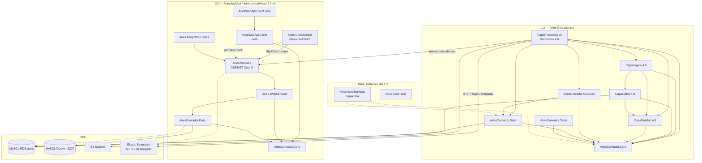
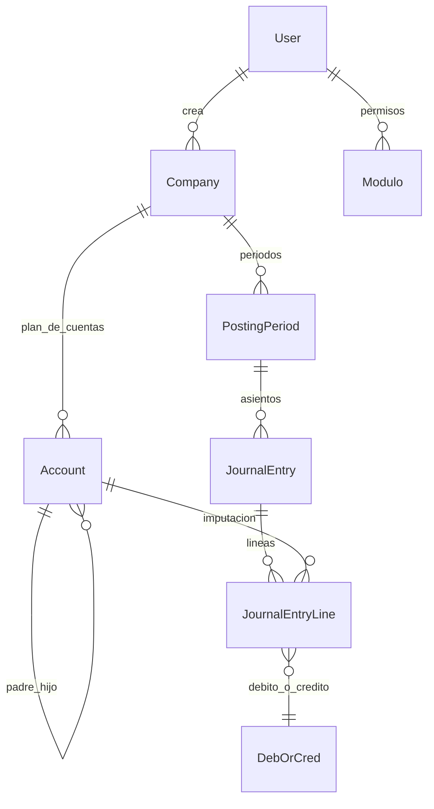
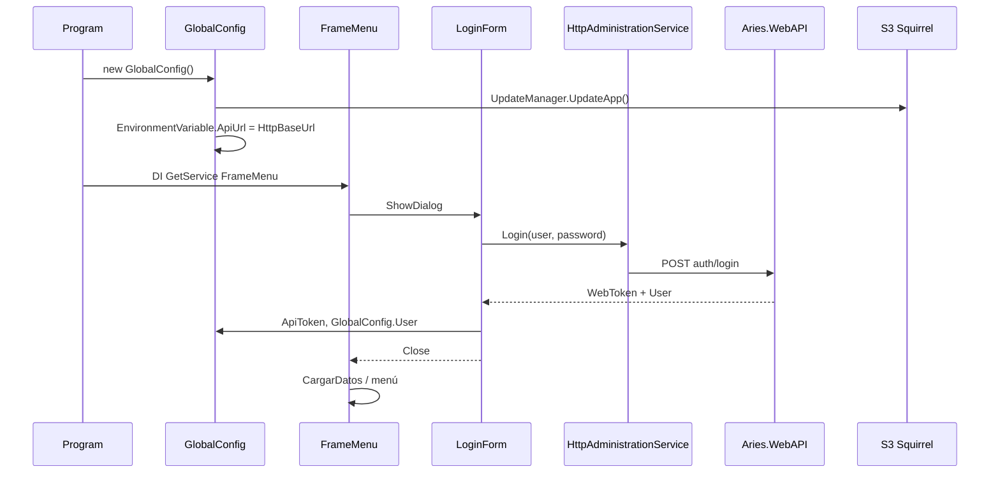
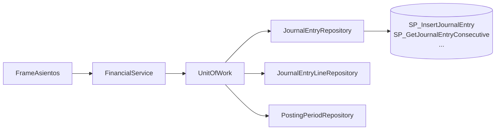
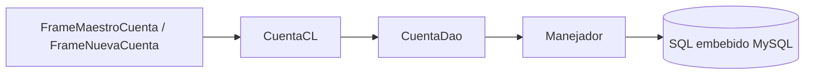

# Aries Contador — Estructura de proyectos y mapa de conexiones

> Layout actual (carpetas y la única solución `Aries.sln`): [`LAYOUT.md`](LAYOUT.md). Este documento describe el mapa histórico de conexiones; varios paths `Capa*` ya no existen en disco. `Aries Contador.sln` se absorbió en `Aries.sln` y ya no existe.

Documento de arquitectura de la carpeta `Aries`. Hay **dos productos / dos git remotes** en el mismo directorio. Hay que tratarlos juntos cuando se reorganicen las soluciones.

| Producto | Carpeta | Solución | Git remote | Qué es |
|---|---|---|---|---|
| **Escritorio 1.x** | raíz `C:\Aries` | `Aries Contador.sln` | `github.com/kenaguilar7/aries-desktop` | WinForms 4.8 (producción actual) |
| **Contabilidad 2.0** | `AriesWebApi/` | `aries.contabilidad.2.0.sln` | Azure DevOps `AriesWebService` (rama `dev`) | API ASP.NET Core 8 + Blazor WASM + Docker |

`AriesWebApi` es un **repositorio git anidado** (tiene su propio `.git`). Por eso no aparece en búsquedas del workspace padre y no forma parte de `Aries Contador.sln`. **Hay que incluirlo en cualquier reorganización de soluciones.**

**Dominio compartido:** contabilidad para Costa Rica (compañías, plan de cuentas, periodos, asientos, reportes).  
**Base de datos:** MySQL (RDS en el escritorio 1.x; Docker local puerto 3307 en 2.0). Esquema, SPs y mapeo a C#: [`MODELOS-BD.md`](MODELOS-BD.md).  
**Plan de migración** (escritorio estable, BD intacta, lógica WinForms, merge de duplicados): [`PLAN-MIGRACION.md`](PLAN-MIGRACION.md).

---

## 1. Lectura rápida

Hay **cuatro caminos de ejecución**, no uno:

| Camino | Dónde vive | Capas | Uso |
|---|---|---|---|
| **Legacy WinForms** | raíz | `CapaPresentacion` → `CapaLogica` → `CapaDatos` → MySQL (ADO.NET) | Plan de cuentas, usuarios, permisos, reportes clásicos |
| **Core in-process** | raíz | `CapaPresentacion` → `AriesContador.Services` → `AriesContador.Data` → MySQL (Dapper + SP) | Asientos, periodos, reportes nuevos |
| **HTTP desde WinForms** | raíz → API | `HttpAdministrationService` → `auth/login`, `company/*` | Login y parte de compañías |
| **Contabilidad 2.0** | `AriesWebApi/` | Blazor WASM → `Aries.WebAPI` → `Aries.WebServices` → `AriesContador.Data` → MySQL | API completo + UI web (login, compañías, cuentas, periodos, asientos) |

El contrato HTTP que usa el escritorio (`auth/login`, `company/getAll`, `company/BuildCode`, `company/delete/{code}`) es **el mismo** que implementa `AriesWebApi/src/Services/Aries.WebAPI`. El API viejo de la raíz (`Aries.WebAPI/`, `SuperAPI/`) está borrado del working tree; el API vivo para reorganizar el producto está en **`AriesWebApi`**.

`AriesContador.Core` y `AriesContador.Data` existen **duplicados**: una copia en la raíz y otra en `AriesWebApi/src/Core/`. No comparten proyecto; hay que unificarlos al juntar soluciones.

**Base de datos:** el esquema real (tablas, FKs, enums, vistas, funciones y stored procedures) está mapeado en [`MODELOS-BD.md`](MODELOS-BD.md), a partir de los dumps en `C:\Users\Steve\Desktop\Aries DUMP`.

---

## 2. Inventario de proyectos

### 2.1 Dentro de `Aries Contador.sln`

| Proyecto | Tipo | Framework | Rol |
|---|---|---|---|
| **CapaPresentacion** | WinExe (Windows Forms) | .NET Framework 4.8 | UI, arranque, DI parcial, config, actualizaciones Squirrel |
| **CapaLogica** | Class library | .NET Framework 4.8 | Reglas de negocio del stack viejo |
| **CapaDatos** | Class library | .NET Framework 4.8 | DAOs + `Manejador` MySQL (SQL embebido / SP vía ADO.NET) |
| **CapaEntidad** | Class library | .NET Framework 4.8 | Modelos, enums, reportes Excel, validaciones, textos |
| **AriesContador.Core** | Class library | netstandard2.0 | Contratos, modelos y patrones del stack nuevo |
| **AriesContador.Data** | Class library | netstandard2.0 | Unit of Work, repositorios Dapper, acceso MySQL |
| **AriesContador.Services** | Class library | netstandard2.0 | Casos de uso + cliente HTTP hacia el API |
| **AriesContador.Tests** | xUnit | netcoreapp3.1 | Tests de periodos (incompletos) |

### 2.2 En la carpeta, **fuera** de la solución

| Proyecto | Framework | Estado |
|---|---|---|
| **Aries.WebServices** | netstandard2.0 | Copia **rota** (merge conflict). La copia buena está en `AriesWebApi`. |
| **Aries.Core** | netstandard2.0 | Stub (`IJournalEntryService` / `"Hello word"`). No está en la solución ni lo usa nadie. |
| **TestingXUnix** | net6.0 / xUnit | Test vacío (clase comentada). No está en la solución. |
| **Test** | C++ Win32 (`Test.vcxproj`) | Proyecto nativo vacío / plantilla. No forma parte del producto. |

### 2.3 Eliminados en la raíz (siguen en git como borrados)

| Carpeta | Qué era |
|---|---|
| **Aries.WebAPI** (raíz) | Primera versión del API (Auth / Company / User). Sustituida por `AriesWebApi/src/Services/Aries.WebAPI`. |
| **SuperAPI** | API de prueba (`WeatherForecast`). No formaba parte del producto. |

`apprunner.yaml` (raíz) referencia `AriesContador.Api` / net7.0, un ensamblado que no existe. El host real del API 2.0 es `Aries.WebAPI` net8.0 dentro de `AriesWebApi`.

### 2.4 `AriesWebApi/` — Contabilidad 2.0 (`aries.contabilidad.2.0.sln`)

Repo git propio. Solución principal: `AriesWebApi/aries.contabilidad.2.0.sln`. Hay otras dos soluciones internas (`src/Services/Aries.WebAPI/Aries.WebAPI.sln` y `src/UI/UI.sln`).

| Proyecto | Ruta | Tipo | Framework | Rol |
|---|---|---|---|---|
| **AriesContador.Core** | `src/Core/AriesContador.Core` | Class library | netstandard2.0 | Dominio y contratos (copia de la raíz) |
| **AriesContador.Data** | `src/Core/AriesContador.Data` | Class library | netstandard2.0 | Repositorios Dapper + UoW (copia de la raíz; MySql.Data 8.3.0) |
| **Aries.WebServices** | `src/Services/Aries.WebServices` | Class library | netstandard2.0 | Casos de uso del API (versión completa, sin merge conflict) |
| **Aries.WebAPI** | `src/Services/Aries.WebAPI` | ASP.NET Core Web | **net8.0** | REST + JWT + Swagger. Punto de entrada del backend |
| **AriesWebApi.Client** | `src/Services/AriesWebApi.Client` | Class library | **net9.0** | SDK HTTP tipado (`AddAriesWebApiClient`) |
| **Aries.Contabilidad** | `src/UI/Aries.Contabilidad` | Blazor WebAssembly | **net8.0** | UI web (MudBlazor). **No referencia** al Client; tiene sus propios HttpServices |
| **Aries.Integration.Tests** | `Tests/Aries.Integration.Tests` | NUnit | net8.0 | Tests de API (`WebApplicationFactory`) |
| **AriesWebApi.Client.Test** | `Tests/AriesWebApi.Client.Test` | xUnit | net9.0 | Tests del SDK cliente |

También incluye: Docker (`docker-compose.yml` API:5000 + UI:8080), MySQL local (`docker-compose.db.yml` puerto 3307), Postman, DocFX (`docs/`), scripts AWS, `swagger.json`.

---

## 3. Mapa de dependencias de proyectos

Flecha = `ProjectReference` (compila contra ese ensamblado).



### Matriz de referencias

| Quién \ usa | Core | Data | Services | Entidad | Logica | Datos |
|---|---|---|---|---|---|---|
| CapaPresentacion | sí | sí (directo) | sí | sí | sí | no |
| CapaLogica | sí | no | no | sí | — | sí |
| CapaDatos | sí | no | no | sí | no | — |
| CapaEntidad | sí | no | no | — | no | no |
| AriesContador.Services | sí | sí | — | no | no | no |
| AriesContador.Data | sí | — | no | no | no | no |
| AriesContador.Core | — | no | no | no | no | no |
| AriesContador.Tests | sí | no | no | no | no | no |
| Aries.WebServices | sí | sí | no | no | no | no |

Notas:

- `CapaPresentacion` **no** referencia `CapaDatos`. El stack viejo respeta esa frontera.
- `CapaPresentacion` **sí** instancia `UnitOfWork` de `AriesContador.Data` en varios forms. Eso rompe la frontera del stack nuevo (la UI conoce persistencia).
- Todo el stack viejo (`Entidad`, `Datos`, `Logica`) ya depende de `AriesContador.Core`. Core es el centro real del **escritorio 1.x**.
- En 2.0 el centro es el **mismo nombre de ensamblado** (`AriesContador.Core`) pero **otro proyecto** bajo `AriesWebApi/src/Core/`. Al unificar soluciones no se pueden dejar las dos copias con el mismo `AssemblyName` sin decidir cuál manda.
- `Aries.WebServices` de la raíz es una copia rota. El de `AriesWebApi` es el que usa el API.

---

## 4. Las dos arquitecturas, lado a lado

```text
┌──────────────────────────────────────────────────────────────────────────┐
│                     CapaPresentacion (WinForms)                          │
│  Program → DI mínimo → FrameMenu → LoginForm / frames MDI                │
│  GlobalConfig: User, Company, ConnectionString, permisos                 │
└───────────────┬───────────────────────────────┬──────────────┬───────────┘
                │                               │              │
     stack viejo│                    stack nuevo│         HTTP │
                ▼                               ▼              ▼
        CapaLogica *CL                  AriesContador.Services    AriesWebApi
        (validaciones,              FinancialService              Aries.WebAPI
         reglas, Excel)             FinancialReportService        auth / company / accounts
                │                   AdministrationService         journal / periods
                ▼                   HttpAdministrationService
        CapaDatos *Dao                          │
        Manejador (MySqlConnector)              ▼
                │                   AriesContador.Data
                │                   UnitOfWork → *Repository
                │                   MySqlDataAccess / Async
                │                               │
                └──────────────┬────────────────┘
                               ▼
                         MySQL (aries)
                    tablas + stored procedures
```

### 4.1 Stack legacy — convención de nombres

Un módulo de negocio se parte en tres clases con el mismo prefijo:

| Capa | Clase típica | Responsabilidad |
|---|---|---|
| Presentación | `FrameMaestroCuenta`, `FrameMaestroUsuario` | Formularios |
| Lógica | `CuentaCL`, `UsuarioCL`, `CompañiaCL` | Validar e invocar DAO |
| Datos | `CuentaDao`, `UsuarioDao`, `CompañiaDao` | SQL / conexión |
| Entidad | `Cuenta`, `Usuario`, `Modulo` | POCO + helpers |

Clases `*CL` actuales: `AsientoCL`, `CompañiaCL`, `CorreoCL`, `CuentaCL`, `FechaTransaccionCL`, `PermisoCL`, `TransaccionCL`, `UsuarioCL`.

`AsientoCL` y `TransaccionCL` tienen casi todo el código **comentado**: los asientos ya se movieron al stack nuevo.

### 4.2 Stack moderno — convención de nombres

Clean-ish architecture en tres ensamblados:

| Capa | Contenido |
|---|---|
| **Core** | Entidades (`Account`, `JournalEntry`, `Company`, `User`, `PostingPeriod`), interfaces de repositorio, `IUnitOfWork`, contratos de servicio, behaviors y factories |
| **Data** | `UnitOfWork`, repositorios concretos, `IConnectionString`, wrapper Dapper |
| **Services** | `FinancialService`, `FinancialReportService`, `AdministrationService`, cliente HTTP |

Los forms nuevos hacen esto a mano (sin DI):

```csharp
IUnitOfWork unit = new UnitOfWork(GlobalConfig.ConnectionString);
_financialService = new FinancialService(unit);
_financialReportService = new FinancialReportService(unit);
```

`Program.cs` sí registra DI, pero solo para HTTP:

```csharp
services.AddSingleton<IHttpAdministrationService, HttpAdministrationService>();
services.AddSingleton<IHttpClientService, HttpClientService>();
services.AddSingleton<FrameMenu>();
```

`IFinancialService` está comentado en el contenedor. Cada form crea su propio `UnitOfWork`.

---

## 5. Detalle por proyecto

### 5.1 `CapaPresentacion` — aplicación de escritorio

Punto de entrada: `Program.Main` → construye `GlobalConfig` (intenta actualizar con Squirrel) → resuelve `FrameMenu` por DI → `Application.Run`.

`FrameMenu` es un contenedor MDI. Al abrirse muestra `LoginForm` modal. Si no hay usuario, cierra la app.

**Pantallas y de qué stack viven**

| Área | Forms | Camino de datos |
|---|---|---|
| Login | `FrameLoginUsuario` (`LoginForm`) | HTTP `auth/login` |
| Menú | `FrameMenu` | orquesta el resto |
| Compañías | `FrameMaestroCompañia`, `FrameSeleccionCompañia` | HTTP getAll / BuildCode / delete + `CompañiaCL` para insert/update local |
| Usuarios | `FrameMaestroUsuario`, `Correo` | `UsuarioCL` / `CorreoCL` |
| Permisos | `FormPermisoUsuario` | `UsuarioCL` + `CompañiaCL` |
| Plan de cuentas | `FrameMaestroCuenta`, `FrameNuevaCuenta`, `FrameSeleccionCuenta`, `LGCuenta` | `CuentaCL` |
| Asientos | `FrameAsientos`, `SwitchAccountEntryPeriod`, `FrameAsientoCierre` | `FinancialService` (nuevo) |
| Periodos | `FrameAdministrarMeses` | `FinancialService` + `FinancialReportService` |
| Restore | `RestoreJournalEntry` | `FinancialService` |
| Reportes (nuevo) | `FrameReporteComprobacion`, `ReporteEstadoResultadoIntegral`, `ReporteAsientos` | `FinancialReportService` |
| Reportes (viejo) | `FrameReporteAuxiliares`, `ReporteBalanceSituacion`, `ReporteMovimientosCuenta`, `ReporteCuenta`, `ReporteCompañia` | `CuentaCL` / `CompañiaCL` + clases en `CapaEntidad.Reportes` |

**Configuración** (`app.config`):

- `DBconnectionString` — MySQL RDS.
- `HttpBaseUrl` — API Elastic Beanstalk.
- `UpdateServerString` — paquete Squirrel en S3 (`ariescontador/updates`).

`CapaPresentacion.Conf.ConnectionString` implementa `AriesContador.Data.IConnectionString` y lee esas claves. Es el puente de configuración entre WinForms y el stack netstandard.

`GlobalConfig` mantiene estado de sesión estático: `User` (Core) se proyecta a `Usuario` (Entidad) para no romper pantallas viejas. También guarda `Company`, lista de cuentas y permisos.

Hay una carpeta `SquirrelTemp/` con restos de empaquetado; no es código de producto.

### 5.2 `CapaEntidad` — modelos y utilidades del stack viejo

Biblioteca ancha, aún usada por la UI y por `CapaLogica`/`CapaDatos`.

| Carpeta | Contenido |
|---|---|
| `Entidades/Cuentas` | `Cuenta` + tipos (`Activo`, `Pasivo`, `Patrimonio`, `Ingreso`, `Egreso`, `CostoVenta`) vía `ITipoCuenta` |
| `Entidades/Compañias` | `Company` **comentado**; `PersonaFisica` / `PersonaJuridica` |
| `Entidades/Usuarios` | `Usuario`, `UsuarioTemporal` |
| `Entidades/JournalEntries` | espejo de modelos Core (migración a medias) |
| `Entidades/FechaTransacciones` | `FechaTransaccion` (periodo del stack viejo) |
| `Entidades/Ventanas` | `Modulo`, `Ventana`, `CRUD`, `VentanaInfo` (seguridad por pantalla) |
| `Entidades/Seguridad` | `IPermiso`, `CRUDItem`, `CRUDName` |
| `Entidades/Reports` | DTOs de reportes (duplicados de Core) |
| `Reportes` | generación Excel (ClosedXML): auxiliares, balance, asientos, maestro de cuentas, P&G |
| `Enumeradores` | `TipoCuenta`, `IndicadorCuenta`, `TipoUsuario`, `EstadoAsiento`, etc. |
| `Verificaciones` | `VerificaString` (cédula, email, vacíos) |
| `Textos` | `TextoGeneral`, `TextoSQL` |
| `Interfaces` | `IDao<T>`, `ICallingForm`, `ITipoCuenta` |

Dependencia hacia Core: el tipo `Company` que circula hoy es `AriesContador.Core.Models.Companies.Company`.

### 5.3 `CapaLogica` — casos de uso viejos

Cada clase instancia su DAO con `new` (sin DI).

| Clase | Función | Estado |
|---|---|---|
| `CompañiaCL` | Insert/Update/GetAll de compañías, validación de ID y correo | Activo; convive con HTTP |
| `UsuarioCL` | CRUD usuarios, unicidad de username | Activo |
| `CuentaCL` | Árbol de cuentas, heredar saldos, ordenar, filtrar sin movimientos | Activo (maestro de cuentas) |
| `FechaTransaccionCL` | Periodos (meses), no duplicar mes, cierre | Activo en reportes viejos |
| `PermisoCL` | Asignar compañías y módulos a un usuario | Activo |
| `CorreoCL` | Usuarios temporales / SMTP | Activo |
| `AsientoCL` | Asientos | Casi todo comentado |
| `TransaccionCL` | Líneas de asiento | Casi todo comentado |

### 5.4 `CapaDatos` — persistencia vieja

`Conexion/Manejador.cs` abre `MySqlConnection` con `ConfigurationManager` (`DBconnectionString`), ejecuta comandos y transacciones `Serializable`.

DAOs: `CompañiaDao`, `CuentaDao`, `UsuarioDao`, `AsientosDao`, `FechaTransaccionDao`, `TransaccionDao`, `PermisoDAO`, `CorreoDao`, `Guachi`.

Estilo: SQL concatenado en C# (no Dapper). `Guachi` es un helper de autorización: si el usuario es `Administrador` permite todo; si no, recorre `usuario.Modulos`.

`SQL/Asiento.cs` guarda fragmentos SQL de asientos.

### 5.5 `AriesContador.Core` — corazón del dominio nuevo

Sin dependencias de proyecto. Paquetes: ClosedXML, Newtonsoft.Json.

**Modelos**

| Área | Tipos |
|---|---|
| Compañías | `Company`, `PersonaFisica`, `PersonaJuridica`, `CompanyType`, `IdType`, `CurrencyTypeCompany` |
| Usuarios | `User`, `UserType`, `Login`, `WebToken` |
| Cuentas | `Account`, `BaseAccount`, `AccountType`, `AccountTag`, `AccountExtension` |
| Comportamiento de saldo | `IBalanceBehavior` → `Debit` / `Credit` |
| Periodos | `PostingPeriod`, `ClosurePostingPeriod`, `PostingPeriodCreator`, extensiones |
| Asientos | `JournalEntry`, `JournalEntryLine`, `JournalEntryHeader`, `JournalEntryStatus`, reportes de borrados |
| Reportes | `BalanceComprobacionReport`, `EstadoResultadoIntegralReport`, `ClosingPostingPeriodReport`, `PostingPeriodInfoReport` |
| Infra | `EnvironmentVariable` (`ApiUrl`, `ApiToken`), `BaseModel` |

**Contratos de repositorio** (`IRepository<T>` + específicos):

- `ICompanyRepository`, `IUserRepository`, `IAccountRepository`
- `IPostingPeriodRepository`, `IJournalEntryRepository`, `IJournalEntryLineRepository`
- `IFinancialReportRepository`
- `IUnitOfWork` agrupa todos y declara `Commit()` (hoy no implementado)

**Contratos de servicio**

- `IAdministrationService` — compañías y usuarios
- `IFinancialService` — cuentas, periodos, asientos y líneas
- `IFinancialReportService` — reportes contables
- `IReportService` — vacío

**Patrones**

- Strategy: débito/crédito para saldos.
- Factory: `IReportFactory`.
- Command / worker: `Command`, `ReportResultadoIntegralActions`.

### 5.6 `AriesContador.Data` — persistencia nueva

`UnitOfWork` recibe `IConnectionString` y crea repositorios lazy. `Commit()` y `Dispose()` lanzan `NotImplementedException`: cada operación abre y cierra conexión por su cuenta. No hay unidad de trabajo real.

`MySqlDataAccess` / `MySqlDataAccessAsync`: Dapper sobre stored procedures, con helpers de transacción.

Repositorios y SP principales:

| Repositorio | Stored procedures / SQL |
|---|---|
| `CompanyRepository` | `SP_InsertCompany`, `SP_UpdateCompany`, SQL `LatestCode`, inserta cuentas en la misma transacción |
| `UserRepository` | `SP_InsertUser`, `SP_GetAllUsers`, `SP_FindUserById`, `SP_UpdateUser` |
| `AccountRepository` | `SP_InsertAccount`, `SP_GetAccountsByCompanyId`, `SP_GetAccountById`, `SP_DesactivateAccount`, `SP_UpdateAccount`, `SP_AuxiliaryAccountsWithBalanceByDateRange` |
| `PostingPeriodRepository` | `SP_InsertPostingPeriod`, `SP_GetAllPostingPeriod`, `SP_ClosePeriod`, `SP_InsertClosingPostingPeriod` |
| `JournalEntryRepository` | `SP_InsertJournalEntry`, `SP_GetJournalEntryByPostingPeriodId`, `SP_GetJournalEntryById`, `SP_GetJournalEntryConsecutive`, `SP_UpdateJournalEntry`, `SP_DesactivateJournalEntry`, `SP_RestoreJournalEntry`, `SP_GetJournalEntryDeletedBydDateRange` |
| `JournalEntryLineRepository` | `SP_InsertJournalEntryLine`, `SP_GetJournalEntryLineByJournalEntryId`, `SP_GetJournalEntryLineById`, `SP_UpdateJournalEntryLine`, `SP_DesactivateJournalEntryLine`, `SP_RestoreJournalEntryLine`, `SP_GetJournalEntyLineDeletedByDateRange` |
| `FinancialReportRepository` | `SP_JournalEntryReportByDateRange`, `SP_EstadoResultadoIntegralReport`, `SP_GetPostingPeriodReport`, `SP_GetClosingPostingPeriodReport` |

`Query/AdministrationQuery.cs` tiene SQL de compañías físicas/jurídicas (estilo viejo, poco usado frente a los SP).

### 5.7 `AriesContador.Services` — aplicación

| Clase | Implementa | Persistencia |
|---|---|---|
| `FinancialService` | `IFinancialService` | `IUnitOfWork` — cuentas, periodos, asientos |
| `FinancialReportService` | `IFinancialReportService` | `IUnitOfWork` — arma DTOs de reportes |
| `AdministrationService` | `IAdministrationService` | `IUnitOfWork` — varios métodos `NotImplementedException` |
| `HttpAdministrationService` | `IHttpAdministrationService` | HTTP al API |
| `HttpClientService` | `IHttpClientService` | `HttpClient` estático + Bearer JWT |

Endpoints que el escritorio llama (prefijo `EnvironmentVariable.ApiUrl`):

| Método | Ruta |
|---|---|
| POST | `auth/login` |
| GET | `company/getAll` |
| GET | `company/BuildCode` |
| DELETE | `company/delete/{code}` |

`HttpClientService` pone el JWT en todas las peticiones. En login el token aún está vacío; el API de login debe aceptar esa llamada sin Bearer (o el primer POST falla).

### 5.8 `Aries.WebServices` (raíz) — copia rota

Misma idea que `AriesContador.Services`, pensada para host ASP.NET. **No usar esta copia al unificar.**

- `AdministrationServices/AdministrationService` — conflicto de merge sin resolver (`<<<<<<< Updated upstream`).
- `FinancialServices/AccountingReportService` — todos los métodos en `NotImplementedException`.

No está en `Aries Contador.sln`. La versión que sí usa el API está en `AriesWebApi/src/Services/Aries.WebServices` (sección 5.10).

`HttpClientService` en 5.7 llama las mismas rutas que `Aries.WebAPI` 2.0. `Auth/login` es `[AllowAnonymous]`, así que el Bearer vacío del primer POST es compatible.

### 5.9 Tests (raíz)

- `AriesContador.Tests`: un test de orden de periodos que no llega a `Assert`.
- `TestingXUnix`: plantilla xUnit net6 vacía.

No hay cobertura de repositorios, servicios ni UI en el escritorio 1.x.

### 5.10 `AriesWebApi` — API, servicios, cliente y UI 2.0

Carpeta: `C:\Aries\AriesWebApi`. Git anidado (Azure DevOps `AriesWebService`, rama actual `dev`). README interno habla también de GitHub `kenaguilar7/ariesv2`.

#### Soluciones internas

| Archivo | Contenido |
|---|---|
| `aries.contabilidad.2.0.sln` | Solución completa (Core, Data, WebAPI, WebServices, Client, Blazor, tests) |
| `src/Services/Aries.WebAPI/Aries.WebAPI.sln` | Solo backend: WebAPI + Core + Data + WebServices |
| `src/UI/UI.sln` | Solo Blazor `Aries.Contabilidad` |

#### Pipeline 2.0

```text
Aries.Contabilidad (Blazor WASM, MudBlazor)
        │  HttpClient "AriesAPI" + AuthenticationHeaderHandler
        ▼
Aries.WebAPI  (net8, JWT Bearer, Swagger en /)
        │  DI: IAdministrationService, IAccountService,
        │      IJournalEntryService, IJournalEntryLineService,
        │      IPostingPeriodService, IUnitOfWork
        ▼
Aries.WebServices  (netstandard2.0)
        │
        ▼
AriesContador.Data → MySQL (Dapper + stored procedures)
        ▲
AriesContador.Core  (contratos y modelos)
```

`AriesWebApi.Client` es un SDK paralelo (`AddAriesWebApiClient(baseAddress)`) pensado para otros hosts (WinForms, tests). **La UI Blazor no lo usa**: duplica `AuthService`, `AccountService`, etc. en `src/UI/Aries.Contabilidad/Services/`.

#### Controladores y rutas (`Aries.WebAPI`)

Base: `[controller]`. CORS: `http://localhost:8080` y `http://54.144.10.65:8080`.

| Controlador | Auth | Rutas |
|---|---|---|
| `AuthController` | AllowAnonymous | `POST /Auth/login` |
| `CompanyController` | `[Authorize]` comentado | `GET /Company/getAll`, `GET /Company/BuildCode`, `POST /Company/Create`, `DELETE /Company/Delete/{id}` |
| `UserController` | `[Authorize]` | `GET /User/GetAllUsers` |
| `AccountController` | `[Authorize]` | `GET /Account/{companyId}/accounts`, `GET /Account/FindAccount/{accountId}`, `GET /Account/balance/{accountId}` |
| `PostingPeriodController` | `[Authorize]` | `GET /PostingPeriod/GetPostingPeriods/{companyId}` |
| `JournalEntryController` | `[Authorize]` | `POST Create/Update/Delete`, `GET GetConsecutiveNumber/{id}`, `GET GetJournalEntries/{id}` |
| `JournalEntryLineController` | `[Authorize]` | Create / Update / Delete / Find por asiento |

`AriesBaseController.UserId` está **hardcodeado a `1`** (el claim JWT no se lee). Login compara usuario/contraseña en texto plano contra `GetAllUsers()`.

Estas rutas `Auth/login` y `Company/*` son las que ya llama `CapaPresentacion.HttpAdministrationService`. Al unificar, el escritorio 1.x puede apuntar a este API en lugar del Elastic Beanstalk viejo.

#### `Aries.WebServices` (copia buena)

A diferencia de la raíz, aquí **no hay merge conflict**. Incluye:

- `AdministrationService` — crea compañía con código consecutivo, copia plan de cuentas desde `CopyFrom` (filtra `Id <= 57`)
- `AccountService`, `JournalEntryService`, `JournalEntryLineService`, `PostingPeriodService`
- `AccountingReportService` — aún stub (`NotImplementedException`)

#### UI Blazor (`Aries.Contabilidad`)

Páginas: Login, Dashboard, Companies (Index/Create/Edit), Account/Create, JournalEntry (list + editor). Componentes: árbol de cuentas, editor de asientos y líneas, picker de periodo. Modelos DTO **propios** (no referencia Core): otro duplicado a unificar.

#### Docker e infra 2.0

- `docker-compose.yml`: servicio `api` (puerto 5000) e `ui` (8080 → 80), imágenes `kenaguilar7/ariesv2-*`
- `docker-compose.db.yml`: MySQL local **3307**, base `AriesContabilidad_Local`
- Postman: `aries-contabilidad.postman_collection.json` + envs dev/prod
- `swagger.json` en la raíz de `AriesWebApi`

#### Tests 2.0

- `Aries.Integration.Tests`: NUnit + `Microsoft.AspNetCore.Mvc.Testing`. El csproj apunta a `..\..\Services\Aries.WebAPI` (ruta incorrecta; el API está en `src/Services/...`).
- `AriesWebApi.Client.Test`: xUnit sobre el SDK.

---


## 6. Mapa de dominio

Nombres de **negocio / Core**. Los nombres físicos MySQL (`accounting_months`, `transactions_accounting`, …) y el catálogo de SP están en [`MODELOS-BD.md`](MODELOS-BD.md).



**Conceptos**

- **Company** (`C001`, …): persona física o jurídica, moneda (colones / dólares / ambas).
- **Account**: árbol título → mayor → auxiliar. El saldo usa strategy Débito/Crédito.
- **PostingPeriod**: mes contable; se puede cerrar (`ClosePostingPeriod`) generando asiento de cierre.
- **JournalEntry / JournalEntryLine**: asiento y sus líneas; hay restore de borrados.
- **User**: `Administrador` vs `Usuario`. El administrador bypasea permisos (`Guachi`).

Equivalencias de nombres (migración):

| Tabla MySQL | Legacy (`CapaEntidad`) | Moderno (`Core`) |
|---|---|---|
| `users` | `Usuario` | `User` |
| `accounts` | `Cuenta` | `Account` |
| `accounting_months` | `FechaTransaccion` | `PostingPeriod` |
| `accounting_entries` | `Asiento` | `JournalEntry` |
| `transactions_accounting` | `Transaccion` | `JournalEntryLine` |
| `companies` | `Compañia` | `Company` |
| `accounts.account_guide` | `IndicadorCuenta` | `AccountType` |

`GlobalConfig.User` (setter) copia `User` → `Usuario` para las pantallas que aún hablan el idioma viejo.

---

## 7. Flujos de ejecución

### 7.1 Arranque y login



Sin token o con usuario nulo, la aplicación termina.

### 7.2 Elegir compañía

`FrameSeleccionCompañia` llama `GetAllCompanies()` por HTTP, filtra `Active`, guarda en `GlobalConfig.Company`. Antes de cambiar de compañía recorre forms abiertos que implementan `INeedValidatedForClose`.

El maestro de compañías mezcla HTTP (listar, código nuevo, borrar) con `CompañiaCL.Insert/Update` directo a MySQL.

### 7.3 Asientos (stack nuevo)



`FrameAsientos`, `SwitchAccountEntryPeriod`, `FrameAdministrarMeses` y `RestoreJournalEntry` siguen este camino.

### 7.4 Plan de cuentas (stack viejo)



Reglas importantes viven aquí: no borrar cuentas de sistema, heredar saldos al crear auxiliar bajo otro auxiliar, ordenar el árbol.

### 7.5 Reportes

Dos generadores:

1. **Nuevo:** `FinancialReportService` + repositorio + ClosedXML en la UI (`FrameReporteComprobacion`, estado de resultados, asientos).
2. **Viejo:** `CapaEntidad.Reportes.*` + `CuentaCL.LLenarConSaldos` (auxiliares, balance de situación, movimientos).

El mismo informe de negocio puede existir duplicado en ambos mundos (`BalanceComprobacionReport` en Core y en Entidad).

---

## 8. Infraestructura y despliegue

```text
Escritorio 1.x                         Contabilidad 2.0 (AriesWebApi)
─────────────────                      ────────────────────────────────
CapaPresentacion.exe                   Aries.Contabilidad (Blazor :8080)
   │ Squirrel                             │ HttpClient
   ▼                                      ▼
S3 ariescontador/updates               Aries.WebAPI (:5000, Docker)
   │ HTTP JWT (login/company)             │ JWT + Swagger
   ▼                                      ▼
Elastic Beanstalk (API 1.x viejo)      Aries.WebServices → Data
App Runner (comentado)                    │
   │                                      ▼
   └──────────► MySQL RDS aries ◄──── opcional mismo RDS
                      ▲
                      └── WinForms también abre MySQL DIRECTO
                          (CapaDatos y AriesContador.Data)

Local 2.0: Docker MySQL :3307  database AriesContabilidad_Local
```

El `HttpBaseUrl` del WinForms hoy apunta al Elastic Beanstalk. El contrato es el de `Aries.WebAPI` 2.0; al reorganizar, ese `HttpBaseUrl` debería apuntar al host de `AriesWebApi`.

`apprunner.yaml` de la raíz no coincide con ningún proyecto (`AriesContador.Api` / net7.0). El compose de 2.0 sí: `docker/api/Dockerfile.api` y `docker/ui/Dockerfile.ui`.

Publicación ClickOnce/Squirrel: `CapaPresentacion.csproj` tiene `InstallUrl` hacia GitHub y `UpdateUrl` local; en runtime manda Squirrel contra S3.

---

## 9. Cómo se conectan los módulos de negocio

Vista por capacidad, no por ensamblado:

```text
                    ┌─────────────┐
                    │   Login     │──── Aries.WebAPI (AriesWebApi)
                    └──────┬──────┘
                           │ GlobalConfig.User
           ┌───────────────┼────────────────┐
           ▼               ▼                ▼
     Compañías         Usuarios         Permisos
     HTTP + CompañiaCL UsuarioCL        PermisoCL
           │               │                │
           ▼               ▼                ▼
     GlobalConfig.Company   Maestro usuario  Módulos/CRUD
           │
     ┌─────┴──────────────────────────┐
     ▼                                ▼
 Plan de cuentas                  Periodos
 CuentaCL / CuentaDao             FinancialService
     │                                │
     └────────────┬───────────────────┘
                  ▼
            Asientos / líneas
            FinancialService
                  │
                  ▼
         Reportes + cierre + restore
         FinancialReportService / CuentaCL
```

---

## 10. Hallazgos estructurales (útiles para seguir migrando)

1. **Migración a medias.** Asientos y reportes nuevos ya están en Core/Data/Services. Cuentas, usuarios, permisos y parte de compañías siguen en Logica/Datos. La UI habla los dos idiomas en el mismo proceso.

2. **Tres caminos a MySQL.** Escritorio ADO.NET, escritorio Dapper, y API remoto. Un insert de compañía puede ir por HTTP o por `CompañiaCL` según el botón.

3. **Dos gits, dos soluciones, mismos nombres.** `AriesContador.Core`, `AriesContador.Data` y `Aries.WebServices` existen en la raíz y otra vez dentro de `AriesWebApi`. Unificar soluciones implica elegir una copia (la de `AriesWebApi` está más avanzada en servicios de API).

4. **`Aries.WebServices` de la raíz está rota** (merge conflict). La copia buena es `AriesWebApi/src/Services/Aries.WebServices`. `AriesContador.Services` en la raíz es el in-process del WinForms + cliente HTTP mínimo.

5. **El API 1.x de la raíz está borrado; el API 2.0 está en `AriesWebApi`.** WinForms sigue apuntando a Elastic Beanstalk. El contrato (`/Auth/login`, `/Company/*`) ya lo cubre `Aries.WebAPI` net8.

6. **`Aries.Core` (raíz) no es `AriesContador.Core`.** Stub `"Hello word"`. No mezclar al armar la solución unificada.

7. **DI incompleto en WinForms.** Solo HTTP está en el contenedor. El resto hace `new` en el form. En 2.0 el API sí registra servicios en `Program.cs`.

8. **`IUnitOfWork.Commit` no existe en la práctica** (ambas copias de Data). Cada SP abre su conexión.

9. **Modelos triplicados en 2.0.** Core, DTOs de Blazor (`Aries.Contabilidad/Models`) y entidades de Entidad 1.x.

10. **Blazor no usa `AriesWebApi.Client`.** Hay dos clientes HTTP del mismo API. El Client es net9; la UI es net8.

11. **`AriesBaseController.UserId` = 1** fijo. JWT no alimenta el usuario de auditoría.

12. **Login en texto plano** en `AuthController` (compara password con `GetAllUsers()`).

13. **Tests 1.x casi nulos.** Los de 2.0 existen pero `Aries.Integration.Tests` tiene rutas de `ProjectReference` sospechosas.

14. **`HttpAdministrationService` importa `AriesContador.Services.Models.Company`**, carpeta que no está en el proyecto 1.x.

15. **Proyectos muertos en la raíz:** `TestingXUnix`, `Test` (C++), `SuperAPI` (borrado), `Aries.Core`.

16. **`AriesWebApi` es git anidado.** Hay que decidir si se convierte en submódulo, se fusiona al repo padre, o se deja como segundo remote al reorganizar.

17. **El esquema MySQL no coincide 1:1 con los repos.** Faltan `SP_UpdateCompany`, `SP_InsertUser` y `SP_UpdateUser` en el dump; `SP_InsertCompany` asigna `NewCompanyId = CompanyId` (variable inexistente); `company_id` es varchar(5) en `companies` y varchar(4) en las tablas hijas. Detalle en [`MODELOS-BD.md`](MODELOS-BD.md).

---

## 11. Árbol de carpetas (producto, sin bin/obj/Squirrel)

```text
Aries/
├── Aries Contador.sln
├── apprunner.yaml
├── ARQUITECTURA.md                 ← este documento
├── MODELOS-BD.md                   ← tablas, vistas, funciones, SPs y mapeo C#
│
├── CapaPresentacion/               UI WinForms (exe)
│   ├── Program.cs
│   ├── GlobalConfig.cs
│   ├── FrameMenu.cs
│   ├── FrameLoginUsuario.cs
│   ├── FrameSeleccionCompañia.cs
│   ├── Conf/ConnectionString.cs
│   ├── FrameCompañias/
│   ├── FrameCuentas/
│   ├── FrameUsuarios/
│   ├── AdminAsientos/
│   ├── MaestroCuentas/
│   ├── Reportes/
│   ├── Restore/
│   └── Seguridad/
│
├── CapaLogica/                     negocio viejo (*CL)
├── CapaDatos/                      DAOs + Manejador
│   ├── Conexion/
│   ├── Daos/
│   └── SQL/
├── CapaEntidad/                    modelos / Excel / enums viejos
│
├── AriesContador.Core/             dominio y contratos nuevos
│   ├── IUnitOfWork.cs
│   ├── Models/  (Accounts, Companies, JournalEntries, PostingPeriods, Reports, Users, Patterns)
│   ├── Repositories/
│   └── Services/
├── AriesContador.Data/             Dapper + UnitOfWork
│   ├── Internal/DataAccess/
│   ├── Query/
│   └── Repositories/
├── AriesContador.Services/         casos de uso + HTTP client
├── AriesContador.Tests/
│
├── Aries.WebServices/              copia 1.x para API (rota, fuera del .sln)
├── Aries.Core/                     stub (fuera del .sln)
├── TestingXUnix/                   test vacío (fuera del .sln)
├── Test/                           C++ vacío (fuera del .sln)
│
└── AriesWebApi/                    ★ Contabilidad 2.0 (git anidado)
    ├── aries.contabilidad.2.0.sln  solución completa
    ├── docker-compose.yml          API :5000 + UI :8080
    ├── docker-compose.db.yml       MySQL :3307
    ├── swagger.json
    ├── src/
    │   ├── Core/
    │   │   ├── AriesContador.Core/
    │   │   └── AriesContador.Data/
    │   ├── Services/
    │   │   ├── Aries.WebAPI/       REST net8 + JWT + Swagger
    │   │   ├── Aries.WebServices/  casos de uso (copia buena)
    │   │   └── AriesWebApi.Client/ SDK HTTP net9
    │   └── UI/
    │       └── Aries.Contabilidad/ Blazor WASM + MudBlazor
    ├── Tests/
    │   ├── Aries.Integration.Tests/
    │   └── AriesWebApi.Client.Test/
    ├── docker/  docs/  config/  mysql/  scripts/  tools/
    └── aries-contabilidad.postman_*.json
```

---

## 12. Resumen de conexiones

Hay **dos clientes y un API que hay que meter en la misma organización de soluciones**.

**Cliente 1.x — `CapaPresentacion.exe`**

1. `CapaLogica` → `CapaDatos` → MySQL (cuentas, usuarios, permisos, reportes clásicos).
2. `AriesContador.Services` → `AriesContador.Data` → MySQL (asientos, periodos, reportes nuevos).
3. `HttpAdministrationService` → **mismo contrato** que `AriesWebApi` (`/Auth/login`, `/Company/*`). Hoy el host es Elastic Beanstalk; el código del API está en `AriesWebApi`.
4. S3 / Squirrel para auto-update.

**Cliente 2.0 — `Aries.Contabilidad` (Blazor)**

1. HttpClient → `Aries.WebAPI` → `Aries.WebServices` → `AriesContador.Data` (copia 2.0) → MySQL.
2. Login, compañías, cuentas, periodos y asientos van **todos por HTTP**. No hay ADO.NET en el browser.

**Al reorganizar soluciones**

- Tratar `AriesWebApi` como pieza de primera clase, no como carpeta ajena.
- Un solo `AriesContador.Core` y un solo `AriesContador.Data`.
- Un solo `AriesContador.Services` (casos de uso). `Aries.WebServices` se absorbe ahí; no queda una capa web paralela.
- `Aries.WebAPI` es el host HTTP compartido por WinForms y Blazor, **como Minimal APIs** (sin Controllers). Detalle en [`PLAN-MIGRACION.md`](PLAN-MIGRACION.md) §4.6.
- Decidir el destino del git anidado (submódulo vs merge vs solution que apunte a ambos remotes).
- `Aries.Core`, `TestingXUnix`, `Test` (C++) y `SuperAPI` no entran en esa solución unificada.
- Esquema MySQL: ver [`MODELOS-BD.md`](MODELOS-BD.md). Completar SPs faltantes (`SP_UpdateCompany`, `SP_InsertUser`, `SP_UpdateUser`), unificar `company_id` varchar(4/5) y no copiar el bug de `SP_InsertCompany`.
